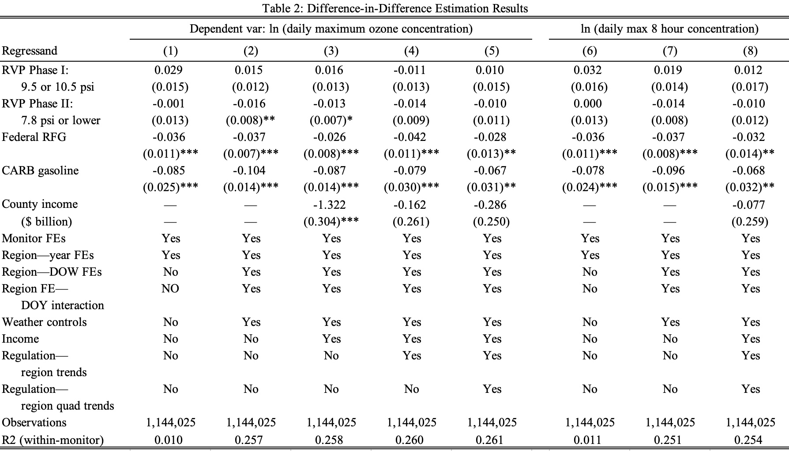
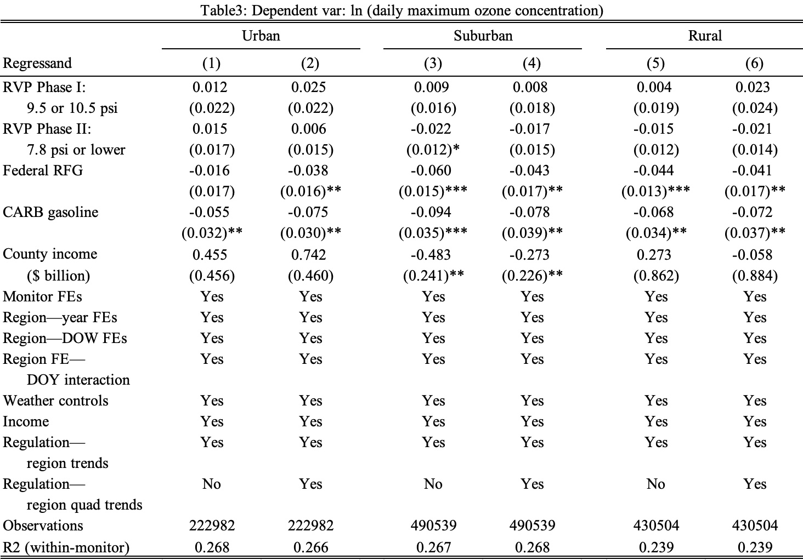
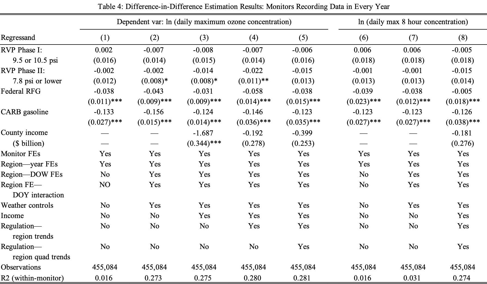
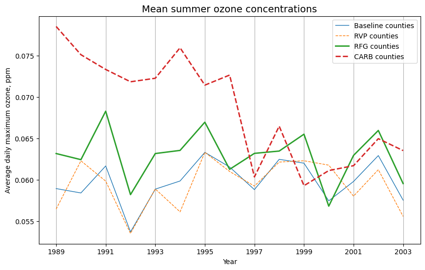
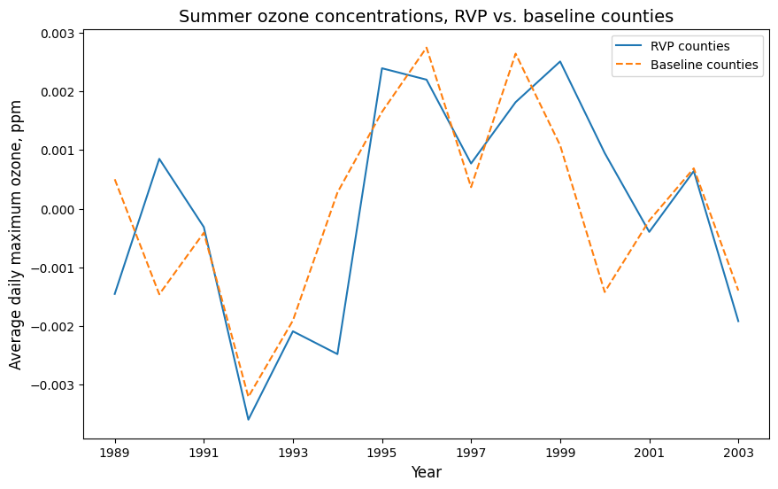
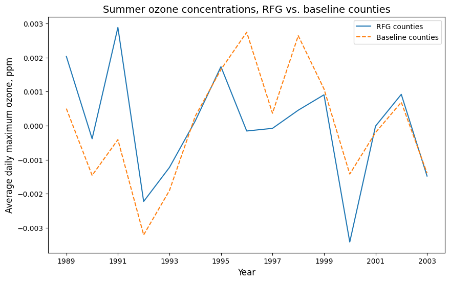
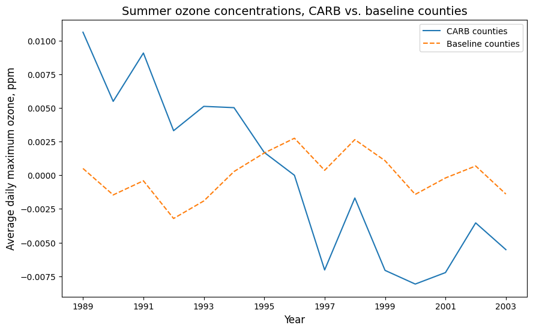

# Using the DiD Model to Analyze the Impact of Policies on Air Quality

This is the course project of STAT 256, using DiD model to analyze the impact of regulations on air quality. 

The reference paper: [Clearing the Air? The Effects of Gasoline Content Regulation on Air Quality](https://home.uchicago.edu/~kelloggr/Papers/AuffhammerKellogg_AER_wApp.pdf)

Results of the project:

